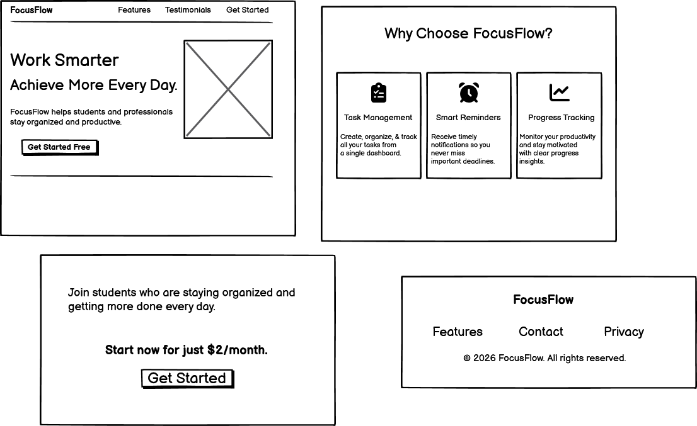

# AI Generated Lnading Page

## Description
This is a simple responsive landing page built using HTML and CSS. The case study is a Productivity app wanting a landing page. It was created as a project to improve my frontend development skills.

## Features
- Responsive layout for desktop and mobile
- Clean landing page structure
-  Organized sections( hero, features, footer)
## How to Run
1. Clone or download the project
2. Open folder
3. Open index.html with live server to show the page on a browser

## AI Usage
I used Balsamiq, a low-fidelity wireframing and UI/UX design tool to create a visual mock up of how the landing  page is going to look like. I wrote the HTML file my self, used AI to generate content. AI was useful in choosing color pallettes and the writing of CSS to make the page responsive.

## Wireframe
### Desktop Design

